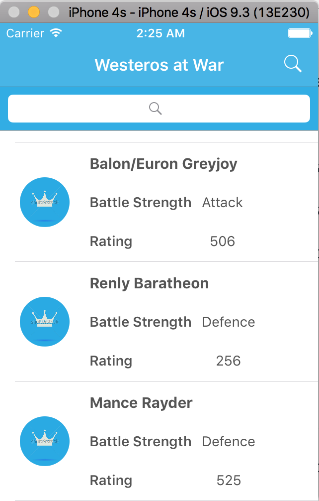
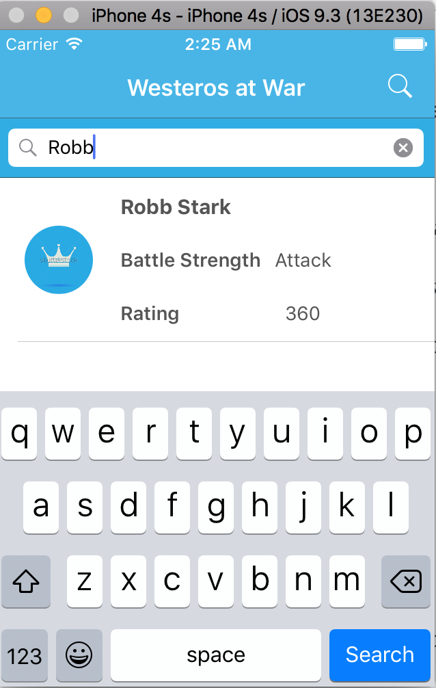
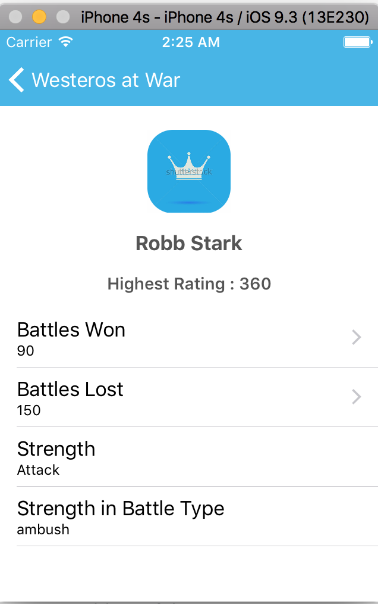

# Westeros_ios_app
Hackathon

An simple iOS application to solve a problem to calcultate scores for kings at war.

Built using 

1. Xcode 8.2.1
2. Swift 2.3

No external libraries used.

Steps to follow:

1. Run the app in above said configurations.

Highligthts:

1. This project is built on the coding standards provided by apple.
2. This uses (NSOperation + NSOperationQueue)API provided by apple with enhanced functionalities proposed by apple in WWDC 2015.
3. Built on latest version of swift 3.0 and xcode 8.2.1

Screenshots

